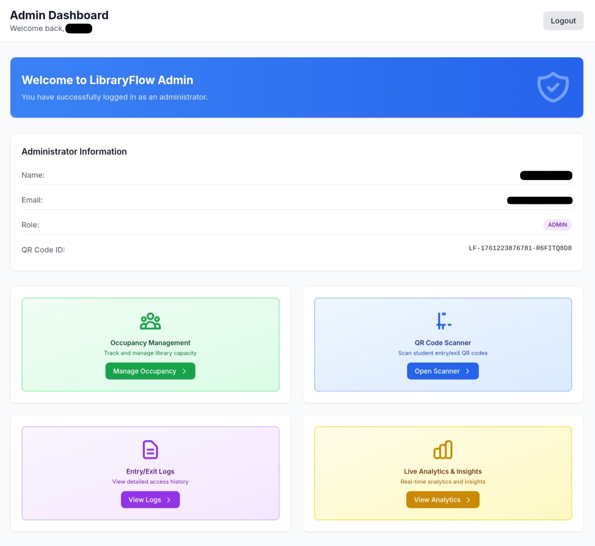
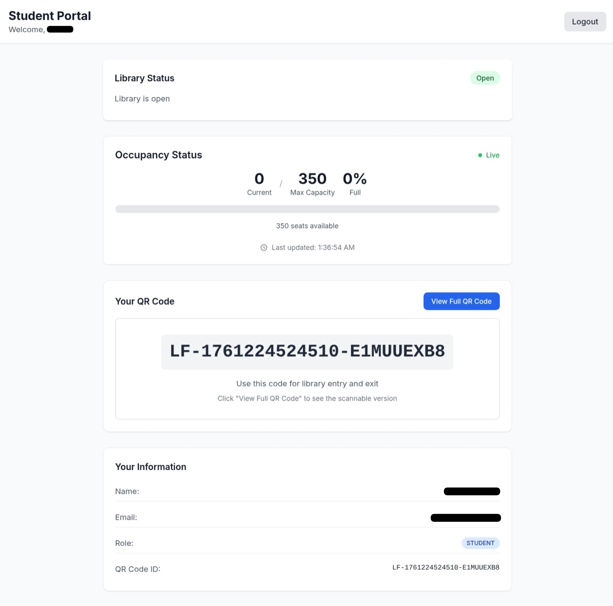

# LibraryFlow

A comprehensive library crowd management system that provides real-time occupancy tracking, QR code-based entry/exit logging, and administrative controls for modern libraries.


## Table of Contents

- [Features](#features)
- [Screenshots](#screenshots)
- [Architecture](#architecture)
- [Quick Start](#quick-start)
- [Configuration](#configuration)
- [Usage Guide](#usage-guide)
- [Development](#development)
- [API Documentation](#api-documentation)
- [Security Features](#security-features)
- [Deployment](#deployment)
- [Contributing](#contributing)
- [License](#license)
- [Authors](#authors)
- [Support](#support)

## Features

### **Student Portal**
- **QR Code Generation**: Each student gets a unique QR code for entry/exit
- **Real-time Occupancy**: Live updates of library capacity and status
- **Entry/Exit Tracking**: Scan QR codes to log entry and exit
- **Status Notifications**: Real-time alerts for library status changes

### **Admin Dashboard**
- **Occupancy Management**: Monitor and control library capacity
- **Library Status Control**: Set library to Open/Closed/Maintenance
- **Auto-Scheduling**: Automatic open/close times
- **Entry/Exit Logs**: Comprehensive logging with filtering capabilities
- **Live Analytics**: Real-time insights and usage statistics
- **Capacity Alerts**: Notifications when library is full or near capacity

### **Technical Features**
- **Real-time Updates**: Socket.io for instant notifications
- **Role-based Access**: Admin and Student user roles
- **QR Code System**: Secure entry/exit tracking
- **Responsive Design**: Mobile-friendly interface
- **TypeScript**: Full type safety across the stack

## **Screenshots**

### Admin Dashboard

*Comprehensive admin interface showing occupancy management, analytics, and library status controls*

### Student Dashboard

*Student portal with QR code generation, real-time occupancy display, and entry/exit tracking*

## **Architecture**

```
LibraryFlow/
├── backend/                # Node.js + Express API
│   ├── src/
│   │   ├── controllers/    # API route handlers
│   │   ├── middleware/     # Authentication & authorization
│   │   ├── routes/         # API route definitions
│   │   ├── services/       # Business logic
│   │   ├── utils/          # Utility functions
│   │   └── types/          # TypeScript type definitions
│   └── prisma/             # Database schema & migrations
├── frontend/               # React + TypeScript SPA
│   ├── src/
│   │   ├── components/     # Reusable UI components
│   │   ├── pages/          # Application pages
│   │   ├── services/       # API service layer
│   │   ├── hooks/          # Custom React hooks
│   │   └── contexts/       # React context providers
└── README.md
```

## **Quick Start**

### Prerequisites
- **Node.js** (v18 or higher)
- **npm** or **yarn**
- **Git**

### 1. Clone the Repository
```bash
git clone https://github.com/AgileSeagull/LibraryFlow.git
cd libraryflow
```

### 2. Backend Setup
```bash
cd backend

# Install dependencies
npm install

# Set up environment variables
cp env.example .env
# Edit .env with your configuration

# Set up database
npx prisma generate
npx prisma migrate dev
npx prisma db seed

# Start the backend server
npm run dev
```

### 3. Frontend Setup
```bash
cd frontend

# Install dependencies
npm install

# Start the frontend development server
npm start
```

### 4. Access the Application
- **Frontend**: http://localhost:3000
- **Backend API**: http://localhost:5000
- **Database Studio**: http://localhost:5555 (optional)

## **Configuration**

### Environment Variables
Create a `.env` file in the `backend` directory:

```env
# Database
DATABASE_URL="file:./dev.db"

# JWT Secret
JWT_SECRET="your-super-secret-jwt-key-here"

# Server Configuration
PORT=5000
NODE_ENV=development
```

### Database Setup
The application uses SQLite by default. To use PostgreSQL:

1. Update `DATABASE_URL` in `.env`
2. Change provider in `prisma/schema.prisma`:
```prisma
datasource db {
  provider = "postgresql"
  url      = env("DATABASE_URL")
}
```

## **Usage Guide**

### For Students
1. **Register/Login**: Create an account or login
2. **Get QR Code**: Your unique QR code is generated automatically
3. **Scan at Library**: Use the QR code scanner at library entrance
4. **Track Occupancy**: View real-time library capacity and status

### For Administrators
1. **Login**: Use admin credentials
2. **Manage Occupancy**: Set max capacity and monitor current occupancy
3. **Control Status**: Set library to Open/Closed/Maintenance
4. **View Analytics**: Access real-time usage statistics
5. **Review Logs**: Filter and analyze entry/exit logs

## **Development**

### Available Scripts

#### Backend
```bash
npm run dev          # Start development server
npm run build        # Build for production
npm run start        # Start production server
npm run db:migrate   # Run database migrations
npm run db:generate  # Generate Prisma client
npm run db:studio    # Open Prisma Studio
npm run db:seed      # Seed database with sample data
```

#### Frontend
```bash
npm start            # Start development server
npm run build        # Build for production
npm test             # Run tests
npm run eject        # Eject from Create React App
```

### Database Management
```bash
# Generate Prisma client
npx prisma generate

# Create and apply migrations
npx prisma migrate dev

# Reset database
npx prisma migrate reset

# Open Prisma Studio
npx prisma studio
```

## **API Documentation**

### Authentication Endpoints
- `POST /api/auth/register` - Register new user
- `POST /api/auth/login` - Login user
- `GET /api/auth/me` - Get current user

### Occupancy Endpoints
- `GET /api/occupancy` - Get current occupancy
- `POST /api/occupancy/scan` - Scan QR code for entry/exit

### Admin Endpoints
- `GET /api/admin/occupancy/stats` - Get occupancy statistics
- `PUT /api/admin/occupancy/max-capacity` - Update max capacity
- `GET /api/admin/occupancy/analytics` - Get analytics data
- `GET /api/logs` - Get entry/exit logs
- `GET /api/analytics` - Get analytics data

### Library Status Endpoints
- `GET /api/library-status` - Get library status
- `PUT /api/library-status` - Update library status

## **Security Features**

- **JWT Authentication**: Secure token-based authentication
- **Role-based Access**: Admin and Student role separation
- **Input Validation**: Zod schema validation
- **CORS Protection**: Cross-origin request security
- **Password Hashing**: bcrypt password encryption

## **Testing**

### Manual Testing
1. **User Registration**: Test student and admin registration
2. **QR Code Scanning**: Test entry/exit functionality
3. **Occupancy Management**: Test capacity controls
4. **Real-time Updates**: Test Socket.io notifications
5. **Admin Features**: Test analytics and logs

### Test Data
The application includes seed data for testing:
- Sample users (students and admins)
- Test QR codes
- Sample entry/exit logs

## **Deployment**

### Production Build
```bash
# Backend
cd backend
npm run build
npm start

# Frontend
cd frontend
npm run build
# Serve the build folder with a web server
```

### Environment Setup
1. Set `NODE_ENV=production`
2. Configure production database
3. Set secure JWT secret
4. Configure CORS for production domain

## **Contributing**

1. Fork the repository
2. Create a feature branch (`git checkout -b feature/amazing-feature`)
3. Commit your changes (`git commit -m 'Add amazing feature'`)
4. Push to the branch (`git push origin feature/amazing-feature`)
5. Open a Pull Request
